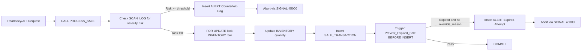
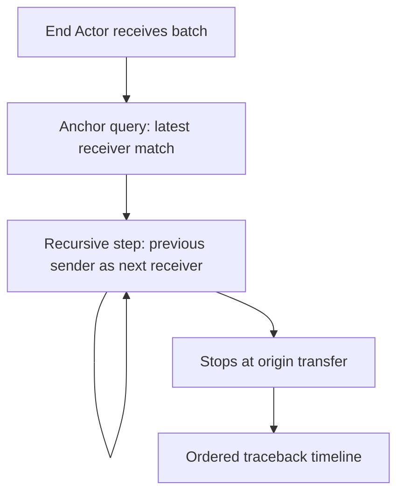

# MedTrack EER Model (Chen-Style, Consistent with Current Schema)

This page is aligned to:

- `db_init/01_tables.sql`
- `db_init/03_procedure.sql` (`PROCESS_SALE`)
- `db_init/04_triggers.sql` (`Prevent_Expired_Sale`)
- `recursive.sql` (`TraceSupplyChain`)
- `db_init/06_security.sql` (RBAC + secure views)

---

## 1) EER Hierarchy: Specialization and Inheritance

```mermaid
flowchart TB
    A[ACTOR<br/>PK actor_id<br/>username UQ<br/>email UQ<br/>role_type] --> I{{ISA<br/>Total + Disjoint (Conceptual)}}
    I --> M[MANUFACTURER<br/>PK/FK actor_id<br/>license_no UQ<br/>production_capacity]
    I --> P[PHARMACY<br/>PK/FK actor_id<br/>pharmacy_license UQ<br/>gps_lat, gps_long]
    I --> D[ADMIN<br/>PK/FK actor_id<br/>security_clearance_level]
```

Interpretation:

- `ACTOR` is the superclass.
- `MANUFACTURER`, `PHARMACY`, `ADMIN` are subclasses.
- Subclass PK is also FK to superclass (`actor_id`).
- Specialization intent is **Disjoint** (one role per actor).

---

## 2) Core Relationships, Cardinalities, and Participation

```mermaid
erDiagram
    ACTOR {
        int actor_id PK
        string username UQ
        string password_hash
        string email UQ
        string role_type
        timestamp registered_at
    }

    MANUFACTURER {
        int actor_id PK FK
        string license_no UQ
        int production_capacity
    }

    PHARMACY {
        int actor_id PK FK
        string pharmacy_license UQ
        decimal gps_lat
        decimal gps_long
    }

    ADMIN {
        int actor_id PK FK
        int security_clearance_level
    }

    MEDICINE {
        int medicine_id PK
        string generic_name
        string brand_name
        decimal base_price
    }

    BATCH {
        int batch_id PK
        int medicine_id FK
        string qr_code_hash UQ
        date mfg_date
        date expiry_date
        int current_owner_id FK
    }

    INVENTORY {
        int pharmacy_id PK FK
        int batch_id PK FK
        int quantity_on_hand
        timestamp last_updated
    }

    TRANSFER_LOG {
        int transfer_id PK
        int batch_id FK
        int sender_id FK
        int receiver_id FK
        timestamp transfer_date
        string status
    }

    SALE_TRANSACTION {
        int txn_id PK
        int pharmacy_id FK
        int batch_id FK
        int quantity_sold
        timestamp sale_timestamp
        int treatment_duration_days
        string override_reason
    }

    SCAN_LOG {
        int scan_id PK
        int batch_id FK
        int scanned_by FK
        decimal gps_lat
        decimal gps_long
        timestamp scan_timestamp
    }

    ALERT {
        int alert_id PK
        int batch_id FK
        string alert_type
        string severity
        timestamp alert_timestamp
    }

    ACTOR ||--o| MANUFACTURER : "is-a"
    ACTOR ||--o| PHARMACY : "is-a"
    ACTOR ||--o| ADMIN : "is-a"

    MEDICINE ||--o{ BATCH : defines
    ACTOR ||--o{ BATCH : currently_owns

    PHARMACY ||--o{ INVENTORY : stocks
    BATCH ||--o{ INVENTORY : inventory_for

    ACTOR ||--o{ TRANSFER_LOG : sends
    ACTOR ||--o{ TRANSFER_LOG : receives
    BATCH ||--o{ TRANSFER_LOG : transferred_in

    PHARMACY ||--o{ SALE_TRANSACTION : sells
    BATCH ||--o{ SALE_TRANSACTION : sold_via

    ACTOR ||--o{ SCAN_LOG : scans
    BATCH ||--o{ SCAN_LOG : scanned_batch

    BATCH ||--o{ ALERT : triggers
```

Participation highlights:

- `MEDICINE -> BATCH`: 1:N, `BATCH` total participation (batch must reference medicine), `MEDICINE` partial.
- `PHARMACY <-> BATCH` via `INVENTORY`: M:N resolved by associative entity with composite PK.
- `BATCH -> SALE_TRANSACTION`: 1:N, sale total participation, batch partial.

---

## 3) Trigger and Procedure Automation Flow



Trigger summary:

- `Prevent_Expired_Sale`: `BEFORE INSERT ON SALE_TRANSACTION`.
- Blocks expired sale without override and writes alert.

---

## 4) Recursive CTE: Chain of Custody (`TraceSupplyChain`)



Logic:

- Starts from final receiver for a target batch.
- Walks backward transfer-by-transfer using sender/receiver linkage.
- Produces complete custody path for audit/admin.

---

## 5) RBAC and View Rights (from `06_security.sql`)

### Secure Views

- `vw_manufacturer_production`
- `vw_pharmacy_public_inventory` (stock status masking)
- `vw_global_threat_dashboard` (GPS rounded/masked)

### Role Privilege Matrix

| Role | Read | Write | Execute |
|---|---|---|---|
| `role_medtrack_admin` | `SELECT` on `PharmaGuard.*` | `UPDATE` on `ALERT` | `TraceSupplyChain` (if present) |
| `role_medtrack_manufacturer` | `SELECT` on `MEDICINE`, `vw_manufacturer_production` | `INSERT` on `BATCH`, `TRANSFER_LOG` | - |
| `role_medtrack_pharmacy` | `SELECT` on `MEDICINE`, `BATCH`, `vw_pharmacy_public_inventory` | `INSERT` on `TRANSFER_LOG`, `SCAN_LOG`, `SALE_TRANSACTION`; `UPDATE` on `INVENTORY` | `PROCESS_SALE` (if present) |

---

## 6) Consistency Notes

- Your narrative is conceptually strong and mostly matches the SQL.
- Two important implementation notes:
- `ACTOR` specialization is conceptually disjoint/total, but DB-level enforcement of "exactly one subtype row per actor" is not fully explicit via constraints/triggers.
- Automatic inventory increase on `TRANSFER_LOG status='Received'` is described in flow, but no trigger for that exists in current SQL files.
